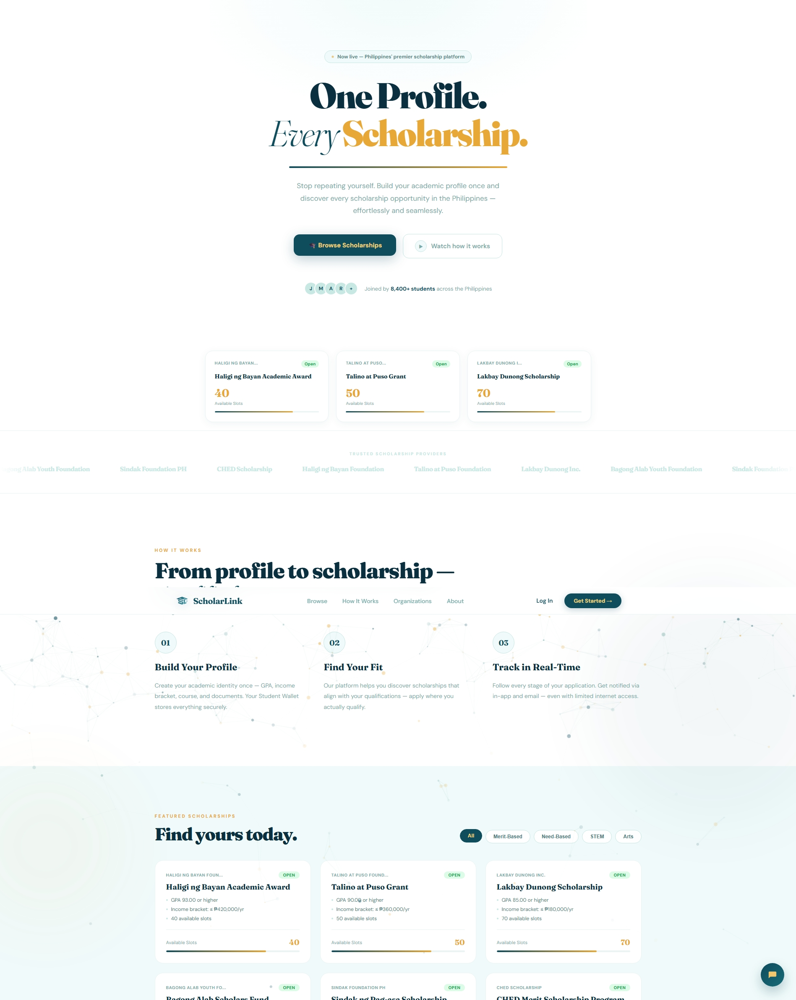
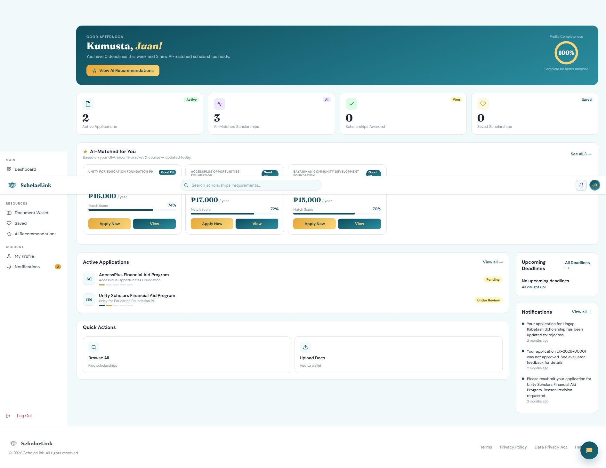
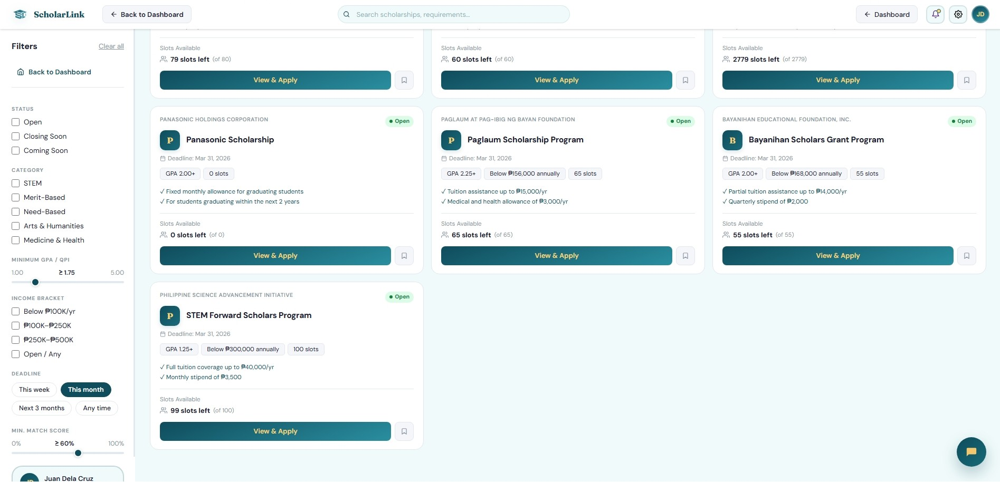
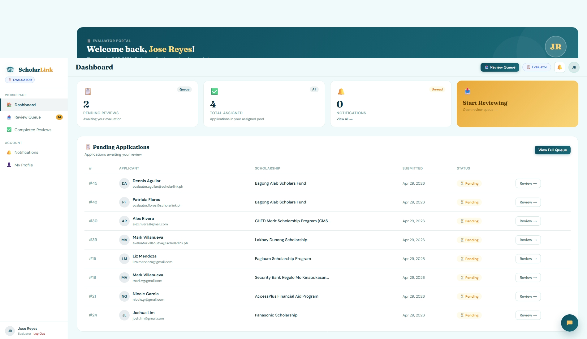
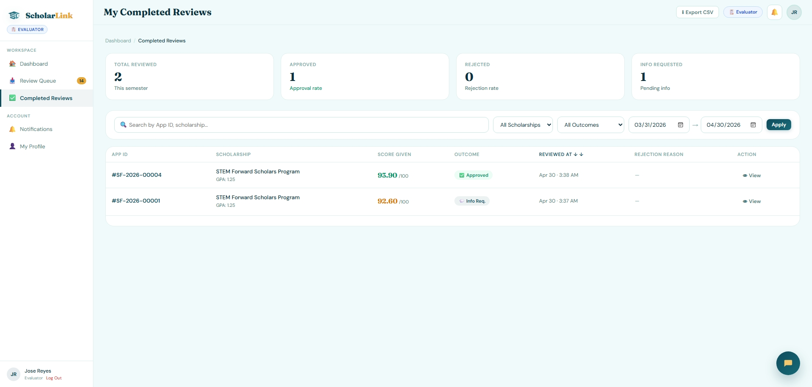
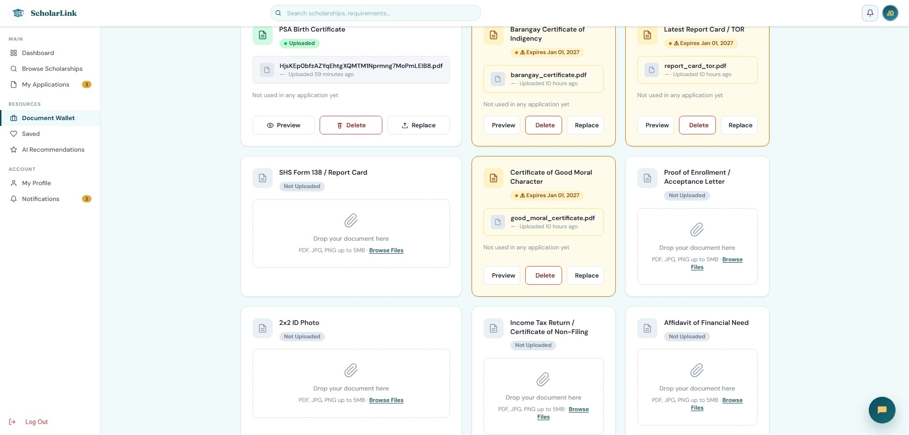
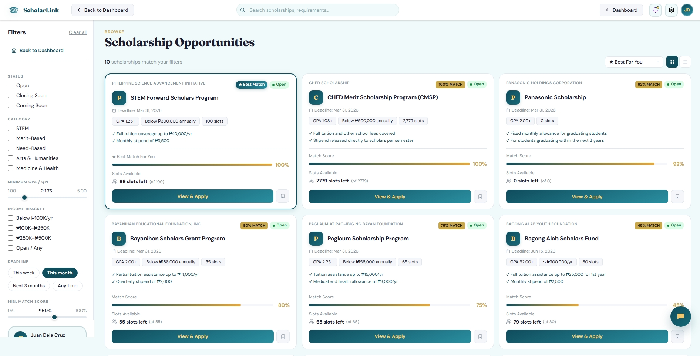
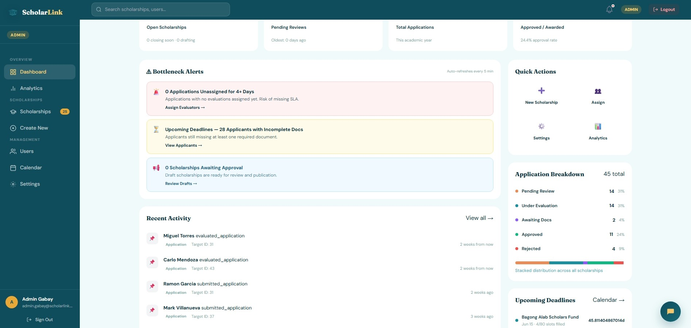
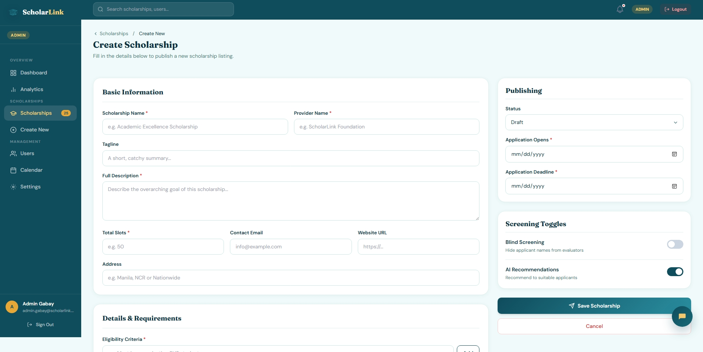

<div align="center">

<br/>


# ScholarLink

### Scholarship Application & Screening Management System

*Modernizing scholarship administration for the Philippines*

<br/>

[](https://laravel.com)
[](https://php.net)
[](https://mysql.com)
[](https://tailwindcss.com)
[](LICENSE)

<br/>



<br/>

</div>

---

## Overview

ScholarLink is a centralized scholarship management platform designed to modernize and digitize the scholarship application process in the Philippines. It streamlines the entire lifecycle — from public scholarship discovery, student profiling, and document management, to blind evaluation and multi-channel notifications.

> Built as a Software Design capstone project, ScholarLink targets transparency, fairness, and accessibility in Philippine scholarship administration.

---

## Screenshots

<br/>

<div align="center">

**Applicant Dashboard**

*Browse scholarships, track applications, and manage your document wallet*

<br/>

**Scholarship Browse — Public**

*No login required — filter by GPA, strand, income bracket, and region*

<br/>

**Blind Evaluation Panel**


*Applicant identity hidden — evaluators see only academic and financial data*

<br/>

| Document Wallet | AI Match Score | Admin Panel | Create Scholarship
|:-:|:-:|:-:|:-:|
|  |  |  |  |
| Upload once, reuse across applications | Gemini-powered compatibility score | Manage scholarships and organizations | Create scholarship for applicants |

</div>

---

## Key Features

### 🔍 Public Scholarship Browsing
- Browse without an account
- Filter by course, GPA, income bracket, and location
- Deadline countdown timers and "Coming Soon" indicators
- Philippine scholarships only

### 👤 Student Profile & Document Wallet
A LinkedIn-style academic profile with reusable document storage:
- GPA and academic records
- Financial documents (ITR)
- Valid government ID
- Certificates and portfolio uploads

Documents are uploaded once and reused across multiple applications — no re-uploading needed.

### 🤖 AI-Powered Scholarship Matching
- Match percentage calculated via **Google Gemini API**
- Eligibility pre-validation before application
- Recommendation explanation shown to applicant
- Prevents ineligible applications from being submitted

### 🧮 Dynamic Weighted Scoring Engine
Configurable scoring per scholarship:
- Merit-focused, needs-focused, or balanced
- Adjustable GPA vs. income weight ratios
- Fully auditable scoring trail per evaluator

### 👁 Blind Screening
During evaluation, the system automatically hides:
- Full name
- Home address
- Gender
- School *(optional per organization)*

Ensures evaluator decisions are based on merit and need — not identity.

### 📈 Application Status Tracking
Real-time status pipeline with color-coded indicators:

| Stage | Description |
|---|---|
| `Submitted` | Application received |
| `Document Review` | Attachments being verified |
| `Under Evaluation` | Assigned to evaluator |
| `Interview Scheduled` | Interview date set |
| `Final Decision` | Accepted or rejected |

### 📅 Automated Deadline Reminders
| Timeline | Channels |
|---|---|
| 14 days before | Email |
| 7 days before | Email + In-app |
| 3 days before | Email + In-app |
| 1 day before | Email + In-app |

---

## User Roles

ScholarLink supports four distinct roles, each with isolated dashboards, route prefixes, and middleware chains.

| Role | Route Prefix | Responsibilities |
|---|---|---|
| **Applicant** | `/applicant` | Browse, apply, track, upload documents |
| **Evaluator** | `/evaluator` | Review anonymized applications, score submissions |
| **Admin** | `/admin` | Manage scholarships, view reports, configure weights |
| **Superadmin** | `/superadmin` | Manage organizations, users, system settings |

---

## Tech Stack

| Layer | Technology |
|---|---|
| Backend Framework | Laravel 12 |
| Auth | Laravel Breeze + Laravel Socialite |
| OAuth Providers | Google, Facebook, Microsoft |
| Frontend | Blade Templates, Tailwind CSS, Vite |
| Database | MySQL 8.0 |
| AI Integration | Google Gemini API |
| Notifications | Email (SMTP) and In App |
| Language | PHP 8.2+ |

---

## Database Schema

Seven core tables power the platform:

```
organizations      users              scholarships
applications       documents          evaluation_scores
notifications
```

---

## Installation

**Requirements:** PHP 8.2+, Composer, Node.js & NPM, MySQL

```bash
# 1. Clone the repository
git clone https://github.com/chezca-v/scholarlink.git
cd scholarlink

# 2. Install dependencies
composer install
npm install

# 3. Configure environment
cp .env.example .env
php artisan key:generate

# 4. Set up database
# Edit .env with your DB credentials, then:
php artisan migrate --seed

# 5. Build frontend assets
npm run build

# 6. Start the server
php artisan serve
```

Visit `http://localhost:8000` to access ScholarLink.

---

## Configuration

Set the following in your `.env` file:

```env
# Database
DB_DATABASE=scholarlink
DB_USERNAME=root
DB_PASSWORD=

# Mail
MAIL_MAILER=smtp
MAIL_HOST=smtp.mailtrap.io
MAIL_PORT=2525

# Google Gemini API (AI Matching)
GEMINI_API_KEY=your_gemini_api_key

# OAuth — Google
GOOGLE_CLIENT_ID=
GOOGLE_CLIENT_SECRET=
GOOGLE_REDIRECT_URI=

# OAuth — Facebook
FACEBOOK_CLIENT_ID=
FACEBOOK_CLIENT_SECRET=
FACEBOOK_REDIRECT_URI=

# OAuth — Microsoft
MICROSOFT_CLIENT_ID=
MICROSOFT_CLIENT_SECRET=
MICROSOFT_REDIRECT_URI=

```

---

## Project Structure

```
app/
├── Http/
│   ├── Controllers/
│   │   ├── Web/
│   │   │   ├── Applicant/
│   │   │   ├── Admin/
│   │   │   ├── Evaluator/
│   │   │   └── Superadmin/
│   │   └── Api/
│   └── Middleware/
│       └── CheckRole.php
├── Models/
│   ├── User.php
│   ├── Scholarship.php
│   ├── Application.php
│   ├── Document.php
│   ├── EvaluationScore.php
│   ├── Organization.php
│   └── Notification.php
└── Services/
    ├── ScholarshipMatchingService.php   ← Gemini API
    └── NotificationService.php          ← Email + SMS
```

---

## Authentication

ScholarLink uses **Laravel Breeze** for session-based auth with OAuth via **Laravel Socialite**:

- Email & password registration / login
- Social login: Google, Facebook, Microsoft
- Role-based access via `CheckRole` middleware
- Separate onboarding flows per role

---

## License

This project is licensed under the **MIT License** — see the [LICENSE](LICENSE) file for details.

---

<div align="center">

<br/>

**ScholarLink** · Software Design 

<br/>

</div>
